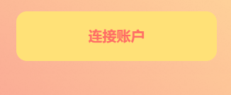

# Publish works

This guide will introduce how to use SparkLink platform functions to create and publish digital collections.

Using SparkLink to create and publish works is very simple!

Visit the SparkLink platform and click on the "Connect Wallet" link in the upper right corner of the meta mask wallet.

**Start authoring and publishing**

Find the Go Publish button on the SparkLink homepage, click it to enter the publish information interface.

On the publishing information page, you need to fill in the relevant information and attributes of the work.

**The following explains part of the attribute information:**

Income ratio: refers to the dividend ratio you get when users share and get income.

&#x20;Pass token: Fill in the symbol of the token used by the user for settlement when purchasing and sharing, and select the corresponding contract address. You can choose ETH as the token on the Ethereum network.

Sale Price: Fill in the price of the first sale, and the unit of calculation is the token filled in above.

Pay attention to the selection of work permissions:

Maximum sharing times: Fill in the maximum sharing times for each digital collection.

**Select the agreement followed by the work:**

Whether to allow secondary creation: It means that after users purchase your work, whether they can perform deduction or translation work on your work, and then share and get benefits. Whether to allow commercial use: Refer to the CC agreement for details. Allow first-level nodes to mint for free: When the option is allowed, the first-level purchase users will not pay other fees except for miners' fees, and users are encouraged to mint and share digital collections. For example: Sam has set the attribute option for the first-level node free casting with the highest share of the work ten times. After this work of Sam is created, the limited ten first-level nodes under the root node can be cast for free. Sam's works start from the second-level node.

Choose whether to use the "encrypted publishing" function when publishing works:

&#x20;When the encrypted release is not selected, the content in the work can be viewed regardless of whether or not the digital collection is cast. When choosing to perform encrypted release, only users who cast digital collections can view the content of the work.

**Upload cover and content:**

Upload a cover image. Only a single JPEG/JPG/PNG image is supported as the cover of the work.

.png>)

**Upload the work file itself, the content is not restricted in form**, you can create and share any inspiration and ideas you have, a picture, a song, a video or even a novel, etc., and support multiple files to upload and package as ZIP Format is uploaded, and the file will be uploaded to the IPFS decentralized distributed storage network for storage.

After filling in the information and uploading the cover of the work and uploading the files, click Submit Information to complete the publishing process of your digital collection.

When the upload of the file is completed, a prompt of the meta mask wallet will pop up, and the corresponding miner fee will be paid when the transaction is confirmed. Wait patiently for a while, after the transaction is packaged, you will be prompted that your work has been successfully published. You can view the details of the works in my collection.

.gif>)

After publishing, click View Details to enter the NFT display interface to confirm the information.

&#x20;

