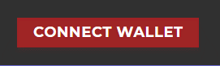
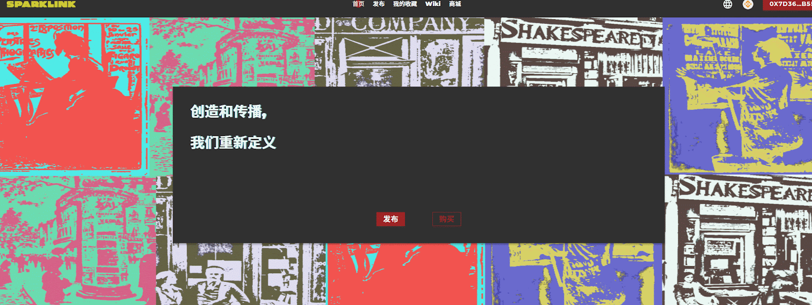
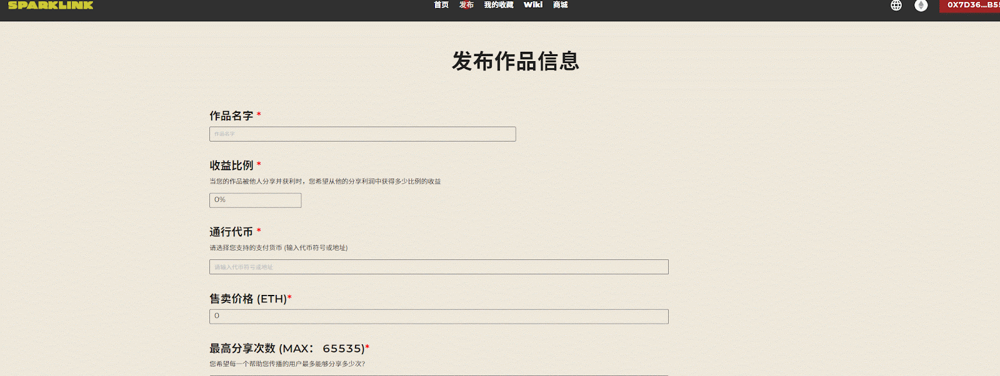
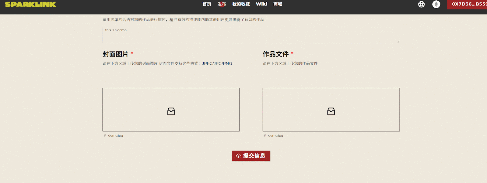
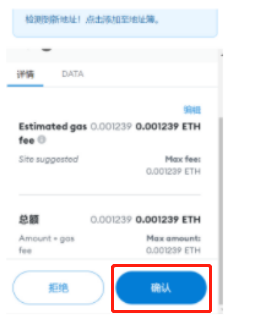
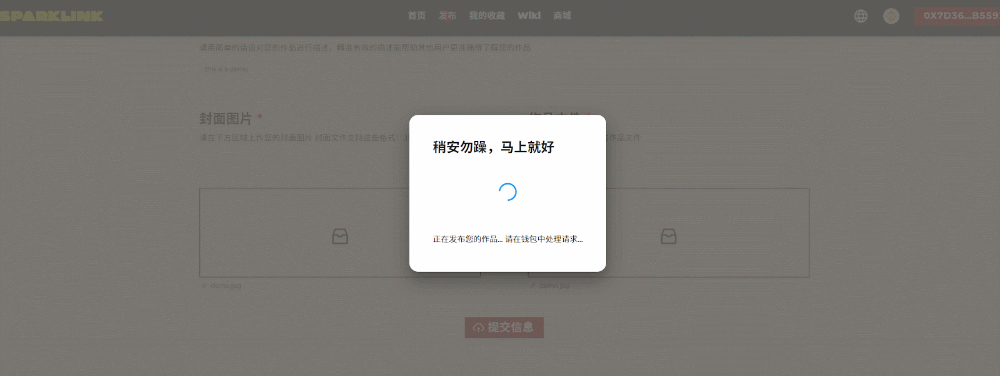

# 发布作品

本指南将介绍如何使用SparkLink平台功能进行数字藏品的创作和发布。&#x20;

使用SparkLink进行作品创作和发布非常简单！

访问[SparkLink平台](http://sparklink.io)，点击右上角“Connect Wallet”链接小狐狸钱包。

本指南将介绍如何使用SparkLink平台功能进行NFT作品的创作和发布。

**开始创作和发布** 在SparkLink首页找到 **去发布** 按钮，点击后进入发布选择界面，你可以选择**加密发布**你的作品，也可以选择**开源发布**你的作品

点击“去发布”按钮访问发布页面，进入填写作品信息流程。

 (1).png>)

你可以选择将你的作品开源保存在IPFS上，或者加密保存在IPFS上。 针对加密的作品，只有持有您发行的NFT的读者才能访问，也就是说只有先购买您的作品后，才可以下载并查看您的作品内容。&#x20;

在发布信息页面，需要填写作品的相关信息和属性。

.png>)

针对开源发布作品，任何人都可以查看并下载作品和内容。&#x20;

以下解释部分属性信息： 收益比例：指当用户分享并获得收益时，您获得的分红比例。

&#x20;通行代币：此处填入用户在购买与分享时用于结算的通证的符号，并选择对应的合约地址，在以太坊主网上可选择ETH作为通证。

.png>)

售卖价格： 填入首次售卖的价格，计算单位为上方填入的通证。&#x20;

**注意作品权限选择**：

最高分享次数：填入每一份数字藏品最大的分享次数。&#x20;

&#x20;1.若点击允许二次创作，则用户被允许在购买您的作品后进行二次创作并出售作品&#x20;

选择作品所遵循的协议：&#x20;

2.若点击允许一级节点免费铸造，则用户可免费在新的Root节点后生成一级节点，一级节点无需付费购买，所有出售计费从二级节点开始。举例：sam设置了作品最高分享为十次，一级节点免费铸造的属性选项，那么sam的此件作品被创造出以后，root节点下的十个一级节点是可以免费被铸造的，sam的作品从二级节点开始收费。

* 是否允许二次创作：意味着当用户购买您的作品之后，是否能够在您的作品上进行演绎或翻译等工作后，再进行分享并获得收益。
* 是否允许商用：详情参考CC协议。
* 允许一级节点免费铸造：当选择允许时，第一级购买用户将不会支付除矿工费之外的其他费用，鼓励用户铸造数字藏品并进行分享。&#x20;

当所有信息步骤完成，上传好你的作品封面与作品内容后点击**提交信息**完成作品提交。

选择发布作品时是否使用“加密发布”功能：

.png>)

* &#x20;当未选择加密发布时，无论是否铸造数字藏品，都能够查看作品中的内容。&#x20;
* 当选择进行加密发布时，仅有铸造数字藏品的用户，才能够查看作品中的内容。

完成上述步骤后，恭喜你已经创造出了第一个属于自己的NFT作品！点击 **查看详情** 查看作品详情信息。

上传封面图片，仅支持JPEG/JPG/PNG的单张图片作为作品封面。

####

**上传作品文件本身，内容不限制形式**，你可以创造和分享你的任何灵感和想法，一张图、一首歌、一段录像甚至是一本小说等等，同时可支持多个文件上传打包为ZIP格式进行上传，文件将会上传至IPFS去中心化分布式存储网络之中储存。

***

填写完信息并完成作品封面的上传和文件上传后，点击提交信息即可完成你的数字藏品发布流程。

当上传文件完成时，会弹出小狐狸钱包的提示，当确认交易时需要支付相应的矿工费用。耐心等待一段时间，待交易打包后将会提示您的作品已经发布成功。在**我的收藏**可查看作品详情。

发布完成后点击**查看详情**，进入NFT展示界面确认信息。
