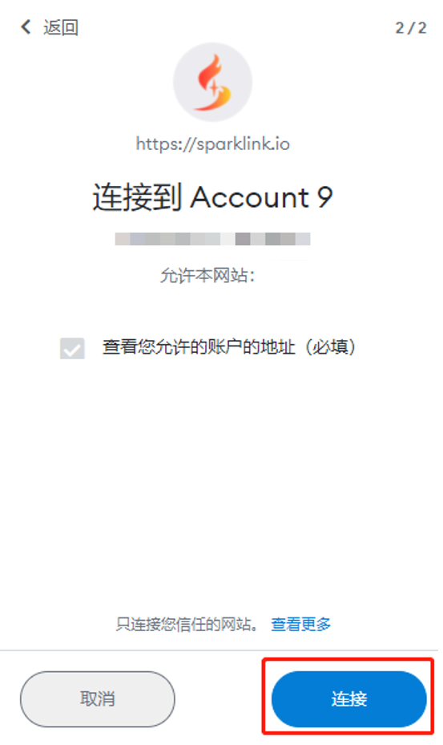
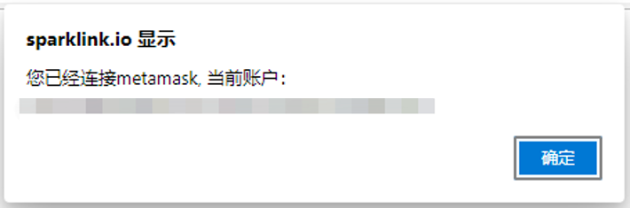

# 连接钱包

为了将你的钱包连接到 SparkLink，在SparkLink.io主页选择右上角的 **Connect Wallet** 图标，选择你目前使用的钱包。

.png>)

接着系统会提示连接请求，请根据提示进行操作。当你看到 “正在连接...”SparkLink 到你的钱包时，就快完成了。

图）

点击链接按钮后，你的钱包就和平台链接成功了。不过不必担心，你只是通过签名的方式链接了SparkLink，加密钱包的归属权以及里面的资产永远只属于你。

现在你已经准备好了！如果你在创作、分享和查看收藏品时遇到问题，请先确保你的钱包已正确连接。
